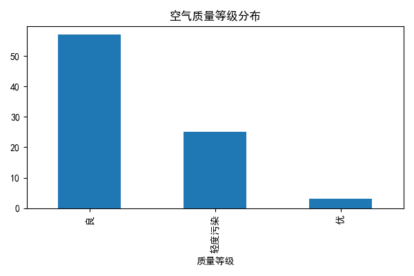
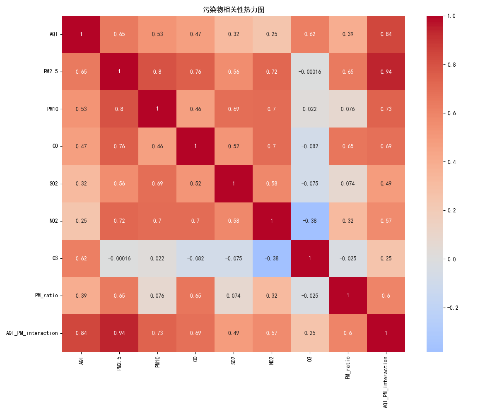
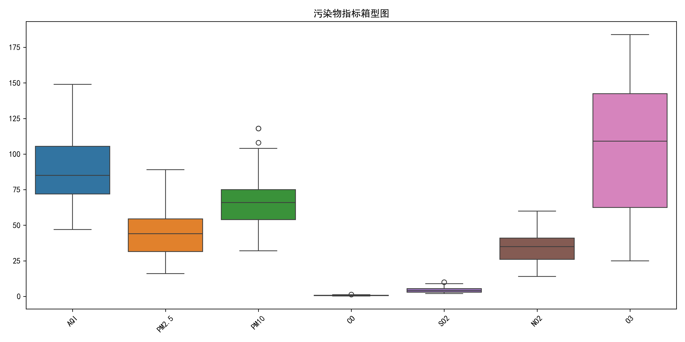
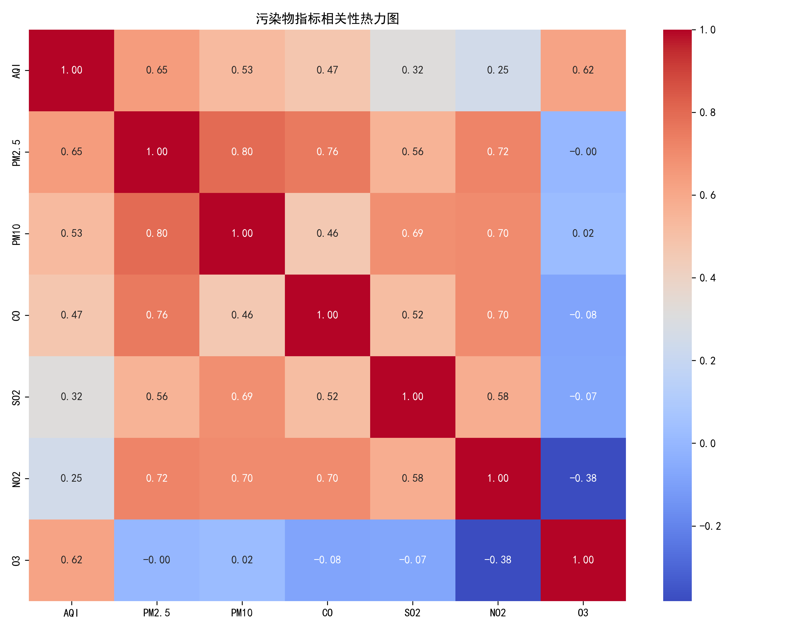
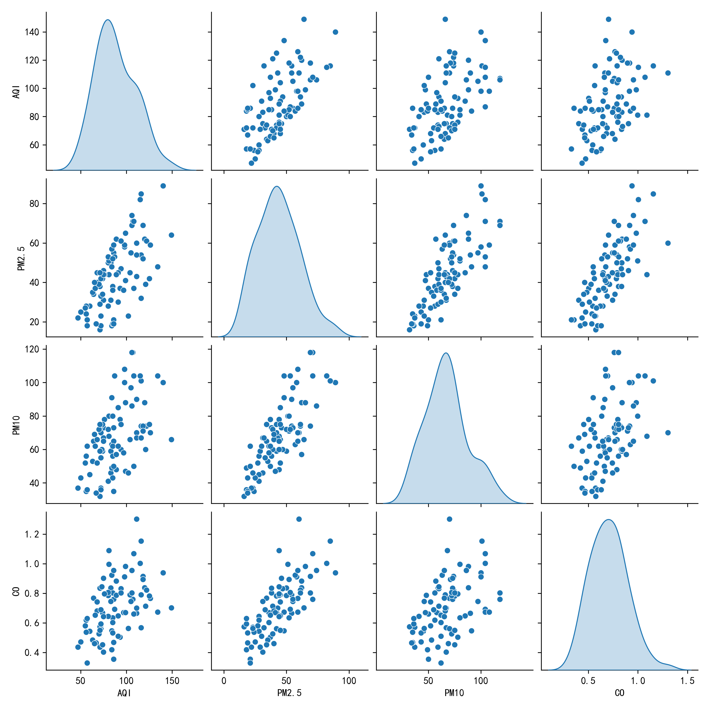
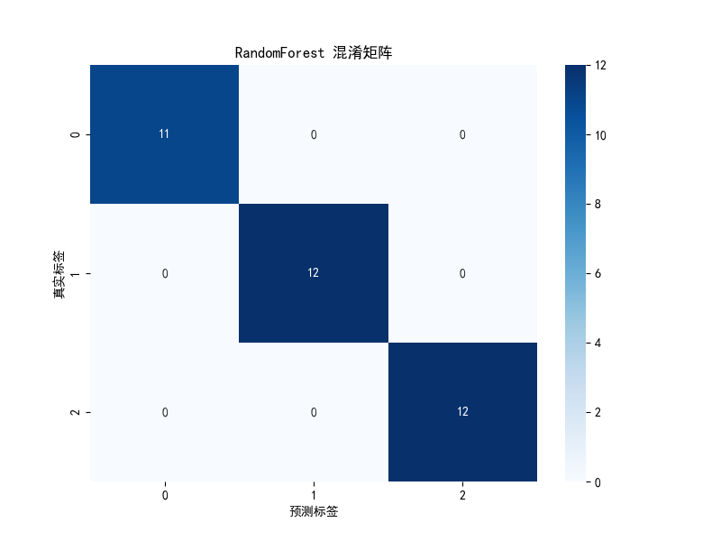
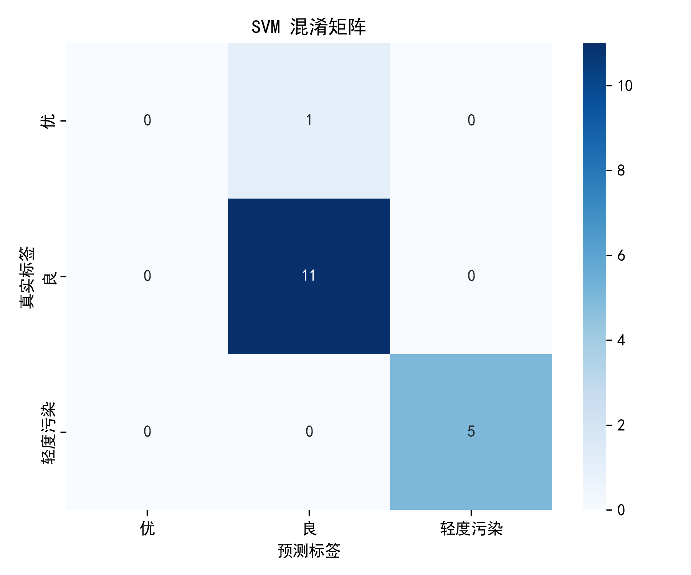

# 空气质量等级分类数据挖掘报告

作者：Zhang Haoyu  
日期：2025-11-11  
项目目录：`d:\Project\python\CourierBoxAI`

---

## 1. 任务目标确定

- 业务问题：基于空气污染物监测指标，对空气质量进行“质量等级”的自动分类，为公众与管理部门提供清晰、及时的空气质量信息。
- 数据挖掘目标：分类（标签为“质量等级”，对输入污染物指标进行等级预测）。
- 预期输出：
  - 输入特征：`AQI`, `PM2.5`, `PM10`, `CO`, `SO2`, `NO2`, `O3` 及构造特征 `PM_ratio`, `AQI_PM_interaction`。
  - 输出：`质量等级`（如：优、良、轻度污染、中度污染等）。
- 实际价值：
  - 公众健康建议与出行提醒的量化依据。
  - 环保部门预警与治理的辅助评估。
  - 支撑空气质量看板的自动化数据分析能力。

---

## 2. 数据搜集

- 数据来源：Kaggle 空气质量监测公开数据集（Air Quality Dataset）。建议在最终提交时补充具体链接与引用信息。
- 数据存储：本地 `data/.xls`（Excel）。
- 数据规模（最近一次运行）：
  - 形状：`(108, 10)`
  - 列名：`['月份', 'AQI', '范围', '质量等级', 'PM2.5', 'PM10', 'CO', 'SO2', 'NO2', 'O3']`
- 数据样本（前 5 行）：
  | 月份 | AQI | 范围 | 质量等级 | PM2.5 | PM10 | CO | SO2 | NO2 | O3 |
  | --- | --- | --- | --- | --- | --- | --- | --- | --- | --- |
  | 2014-01-01 | 125 | 26~402 | 轻度污染 | 94 | 123 | 1.948 | 51 | 65 | 37 |
  | 2014-02-01 | 184 | 33~428 | 中度污染 | 148 | 155 | 2.171 | 56 | 69 | 42 |
  | 2014-03-01 | 130 | 35~319 | 轻度污染 | 94 | 138 | 1.390 | 34 | 62 | 83 |
  | 2014-04-01 | 127 | 65~279 | 轻度污染 | 89 | 145 | 0.927 | 16 | 57 | 129 |
  | 2014-05-01 | 107 | 46~205 | 轻度污染 | 61 | 118 | 0.839 | 15 | 47 | 149 |
- 字段类型：
  - 标签：`质量等级`
  - 指标：`AQI`, `PM2.5`, `PM10`, `CO`, `SO2`, `NO2`, `O3`
  - 构造特征：`PM_ratio = PM2.5 / (PM10 + 1e-6)`, `AQI_PM_interaction = AQI * PM2.5`
  - 其他：可能包含 `月份` 或区域/范围等上下文列
- 数据规模：运行 `main.py` 后在控制台打印（`df.shape`）。请将具体行/列数补充到此处。
- 数据样本：运行后已在控制台展示 `df.head()`。可将样本前 5 行粘贴到报告，便于评审。

---

## 3. 数据预处理与探索

- 缺失值处理：
  - 数值列：均值填充（`fillna(mean)`）。
  - 训练前剔除特征与标签缺失样本（`dropna()`）。
- 重复值处理：删除重复行（`drop_duplicates()`）。
- 异常值处理：对数值列使用 IQR（四分位距）规则剔除极端异常值。
- 规范化/标准化：在 SVM 流水线中使用 `StandardScaler` 对特征进行标准化。
- 特征选择与构造：
  - 自动过滤非数值列，仅保留数值型特征用于建模。
  - 构造 `PM_ratio` 与 `AQI_PM_interaction` 强化可分性与交互表达。
- 类不平衡处理：使用 SMOTE（过采样）在训练前平衡类别分布，并根据最小类别样本数自动调整 `k_neighbors`。
- 数据探索与可视化（已生成）：
  - 标签分布：`quality_dist.png`
  - 相关性热力图：`corr_heatmap.png`
  - 历史探索图表（已存在，可参考）：`boxplot.png`, `heatmap.png`, `pairplot.png`
- 图表引用：
  - 
  - 
  - 
  - 
  - 
  - 
- 观察建议（示例模板，请依据图表补充）：
  - 哪些污染物与 `AQI` 相关性较强？是否存在共线性（如 PM2.5 与 PM10）？
  - 哪些指标分布偏态明显？异常值在箱型图中表现如何？
  - 是否存在类别不平衡（从标签分布图可见）？

---

## 4. 建立模型

- 标签与特征：
  - 标签列：`质量等级`（代码中固定为该列）。
  - 特征列：`AQI`, `PM2.5`, `PM10`, `CO`, `SO2`, `NO2`, `O3`, `PM_ratio`, `AQI_PM_interaction` 等（自动过滤非数值列）。
- 算法选择（至少两种，本项目为三种）：
  - 决策树（CART）
    - 选型理由：可解释性强、对非线性与特征交互适应性好、建立快速基线。
  - 支持向量机（SVM, RBF/Linear）
    - 选型理由：在中小规模数据上表现稳定、对复杂决策边界有较强拟合能力；需要标准化。
  - 随机森林（RandomForest）
    - 选型理由：集成学习方法，鲁棒性强、泛化能力好、可处理高维特征与非线性关系。
- 训练/验证策略：
  - 按最小类别样本数动态设定交叉验证折数（`n_splits`）。
  - 使用 SMOTE 进行过采样后，再进行 `train_test_split(test_size=0.2, stratify=y_res)`。
- 超参数与流水线：
  - 决策树：网格搜索 `max_depth`, `criterion`。
  - SVM：流水线 `StandardScaler + SVC(probability=True)`，网格搜索 `C`, `kernel`。
  - 随机森林：网格搜索 `n_estimators`, `max_depth`, `min_samples_split`。
- 模型持久化（已生成）：
  - `decision_tree.pkl`, `svm.pkl`, `randomforest.pkl`

---

## 5. 评估与验证


- 评估指标：
  - 准确率（Accuracy）
  - 精确率（Precision，加权）
  - 召回率（Recall，加权）
  - F1（F1-score，加权）
  - 分类报告（每类的 `precision/recall/f1/support`）
  - ROC-AUC（对具备 `predict_proba` 的模型计算多类 OVR）
- 交叉验证：
  - 控制台输出 `{n_splits}-fold` 交叉验证平均准确率与方差范围（代码已打印）。
- 测试集评估（已保存到 `metrics.md`；以下为当前结果）：

# 模型评估结果

## 决策树
- 准确率: 0.9412
- 精确率(加权): 0.8873
- 召回率(加权): 0.9412
- F1(加权): 0.9130

```
              precision    recall  f1-score   support

           优       0.00      0.00      0.00         1
           良       0.92      1.00      0.96        11
        轻度污染       1.00      1.00      1.00         5

    accuracy                           0.94        17
   macro avg       0.64      0.67      0.65        17
weighted avg       0.89      0.94      0.91        17

```

## SVM
- 准确率: 0.9412
- 精确率(加权): 0.8873
- 召回率(加权): 0.9412
- F1(加权): 0.9130

```
              precision    recall  f1-score   support

           优       0.00      0.00      0.00         1
           良       0.92      1.00      0.96        11
        轻度污染       1.00      1.00      1.00         5

    accuracy                           0.94        17
   macro avg       0.64      0.67      0.65        17
weighted avg       0.89      0.94      0.91        17

```


  ### 决策树
  - 准确率: 0.9412  
  - 精确率(加权): 0.8873  
  - 召回率(加权): 0.9412  
  - F1(加权): 0.9130
  - 混淆矩阵：`decision_tree.png`
  - 混淆矩阵：`svm.png`
  - 混淆矩阵：`randomforest.png`
  - 混淆矩阵（本次报告引用“最新”与“历史”两套，便于比对）：
    - 最新：
      - 
      - 
      - 
    - 历史（训练早期的基线图，文件名以 `cm_*` 命名）：
      - 
      - 
  - 说明：若历史与最新评估数值存在差异，请以“最近一次控制台评估”为准（已在报告上方详细列出）。